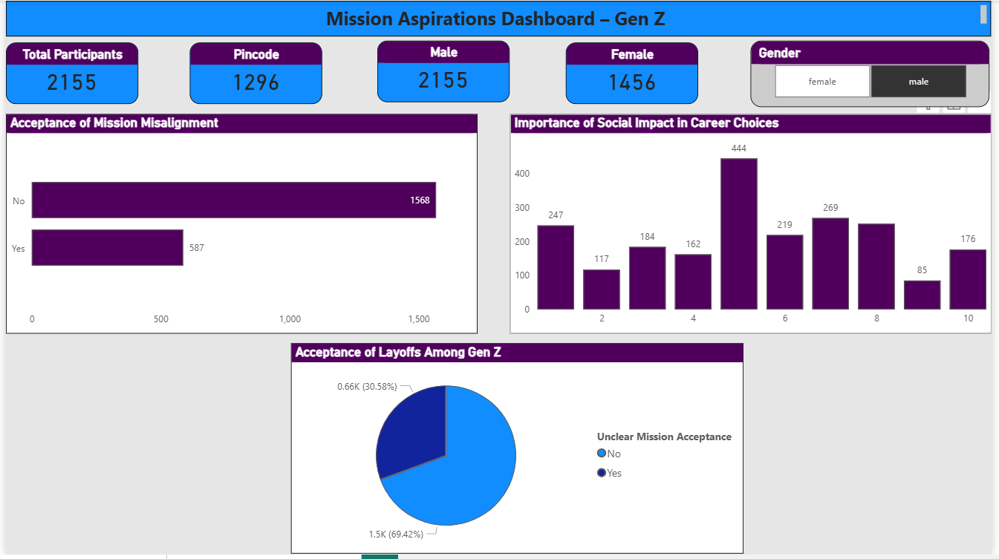
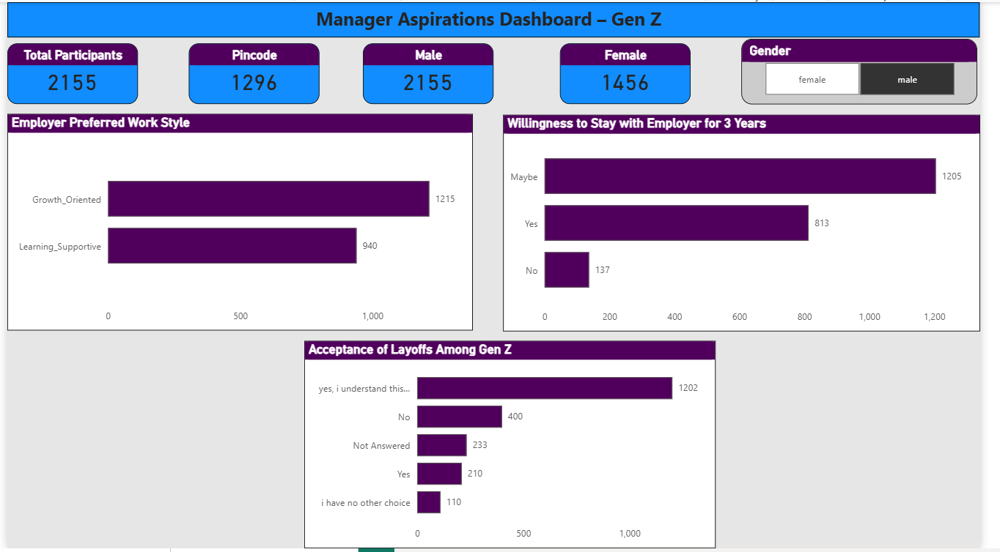
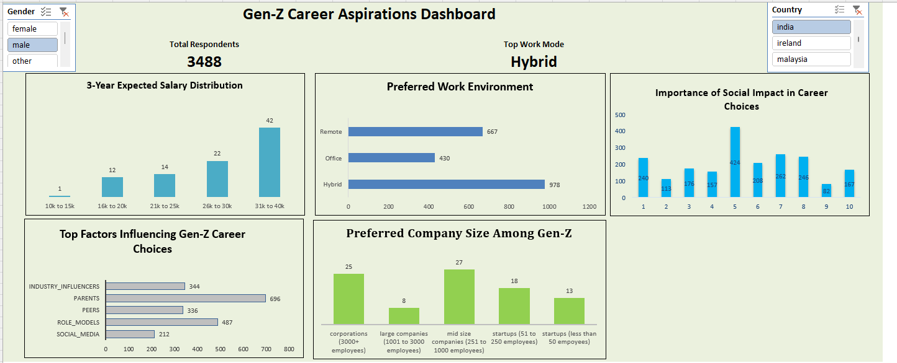

# Gen Z Career Aspirations – Power BI Dashboard 📊

## 📌 Project Overview
This project analyzes Gen Z career aspirations using survey data to provide actionable insights for HR leaders, recruiters, and employers.

## 🎯 Objective
- Understand mission-driven and managerial career preferences
- Analyze willingness to stay with employers
- Evaluate acceptance of layoffs and work style expectations

## 🛠 Tools Used
- Power BI
- MS Excel
- Data Cleaning & Visualization

## 📊 Dashboard Previews

### Mission Aspirations Dashboard

### Manager Aspirations Dashboard

### Detailed Gen Z Career Aspirations Dashboard

## 📄 Detailed Report
📥 [View Full PDF Report](report/Gen_Z_Career_Aspirations_PowerBI_Report.pdf)

## 🔍 Key Insights
- Learning and growth are top priorities for Gen Z
- Long-term loyalty is conditional
- Transparency and mission alignment influence career decisions

## 📌 Recommendations
- Build learning-focused work environments
- Train managers as mentors
- Promote mission-driven employer branding
